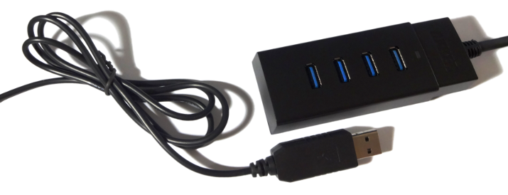

# io-usb

Nim bindings for libusb, the cross-platform user library to access USB devices.



## About

io-usb contains binding to libusb for the [Nim](http://nim-lang.org) programming
language. libusb provides generic access to USB devices. It is portable,
requires no special privileges or elevation and supports all versions of the
USB protocol.


## Supported Platforms

io-usb is still under development and may not fully work yet. So far, the
following platforms have been built and tested:

- ~~Android~~
- ~~FreeBSD~~
- ~~iOS~~
- Linux
- Mac OSX
- ~~OpenBSD~~
- Windows

All APIs marked as deprecated or intended solely for backwards compatibility
have been ommitted from these bindings.


## Prerequisites

To run programs compiled with the bindings in this package you must have
**libusb** installed on your computer.

### Android

TODO

### FreeBSD

TODO

### iOS

TODO

### Linux

If you are using Linux then libusb is most likely already installed on your
computer. If your Linux distribution includes a package manager or community
repository, it likely also has the latest pre-compiled binaries for libusb.

For example, on ArchLinux you can get the library from the package manager:

`sudo pacman -Sy libusb`

Alternatively, you can download the latest source code from the libusb GitHub
repository and compile the library yourself.

### Mac OSX

The easiest way to install pre-compiled binaries is through Macports:

`sudo port install libusb`

Another option is to use Homebrew:

`brew install libusb`

You may have to add a symbolic link to the installed library, so that your
program is able to load it at run-time, for example:

`sudo ln -s /opt/local/lib/libusb-1.0.dylib /usr/lib/libusb.dylib`

Alternatively, you can download the latest source code from the libusb GitHub
repository and compile the library yourself. An Xcode project is included.

### OpenBSD

TODO

### Windows

Download the latest Windows Binaries snapshot from the *libusb* web site, copy
the ``libusb-1.0.dll`` file into your program's folder and rename it to
`libusb.dll`. Alternatively, you can download and compile the DLL from the
source code in the *libusb* GitHub repository.

## Dependencies

io-usb does not have any dependencies to other Nim packages at this time.


## Usage

Import the *libusb* module from this package to make the bindings available
in your project:

```nimrod
import libusb
```


## Support

Please [file an issue](https://github.com/nimious/io-usb/issues), submit a
[pull request](https://github.com/nimious/io-usb/pulls?q=is%3Aopen+is%3Apr)
or email us at info@nimio.us if this package is out of date or contains bugs.
For all other issues related to USB devices visit the libusb web site below.


## References

- [libusb Homepage](http://libusb.info/)
- [libusb GitHub Repository](https://github.com/libusb/libusb)
- [libusb API Documentation](http://libusb.sourceforge.net/api-1.0/index.html)
- [Homebrew Homepage](http://brew.sh)
- [Macports Homepage](http://www.macports.org)
